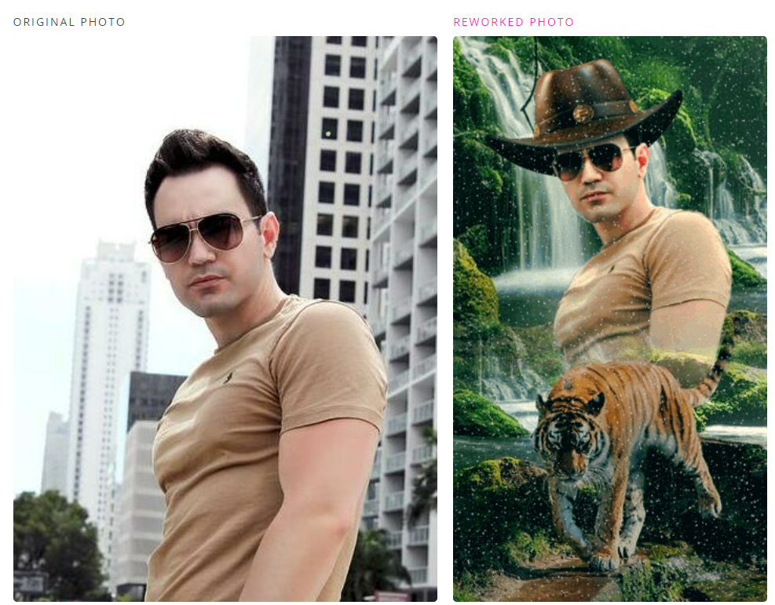
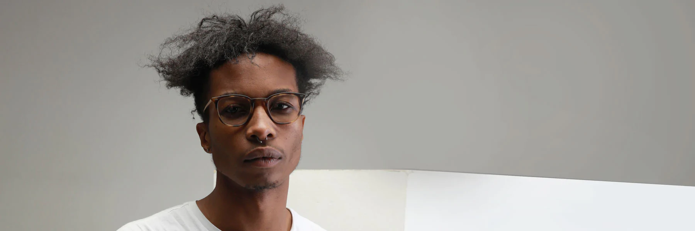
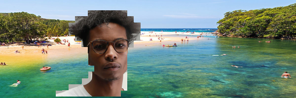
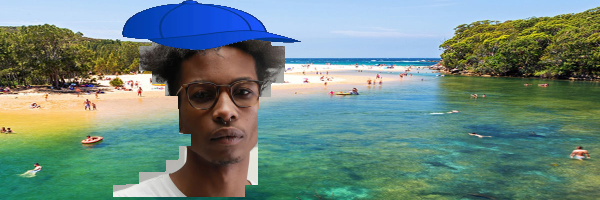

# To make an Image Segmentation model which can extract the human, replace the background and add cap on the head. 

# Plan: 

1. Use Mask RCNN model to find the exact pixal for the human body. 
2. Use OpenCV Haarcascase model to find the coordinates of head.
3. Place image of cap on the head of person. 

# Files:
1. Run msk_rcnn.py to segment human body from the image and replace the background. 

**Input**

**output**

2. Run add_cap.py to add Cap on the image with updated background

**Input**

**output**

`Its funny how our espection turns into reality :)` 

We have to experiment with different parameters to imporve the result. 